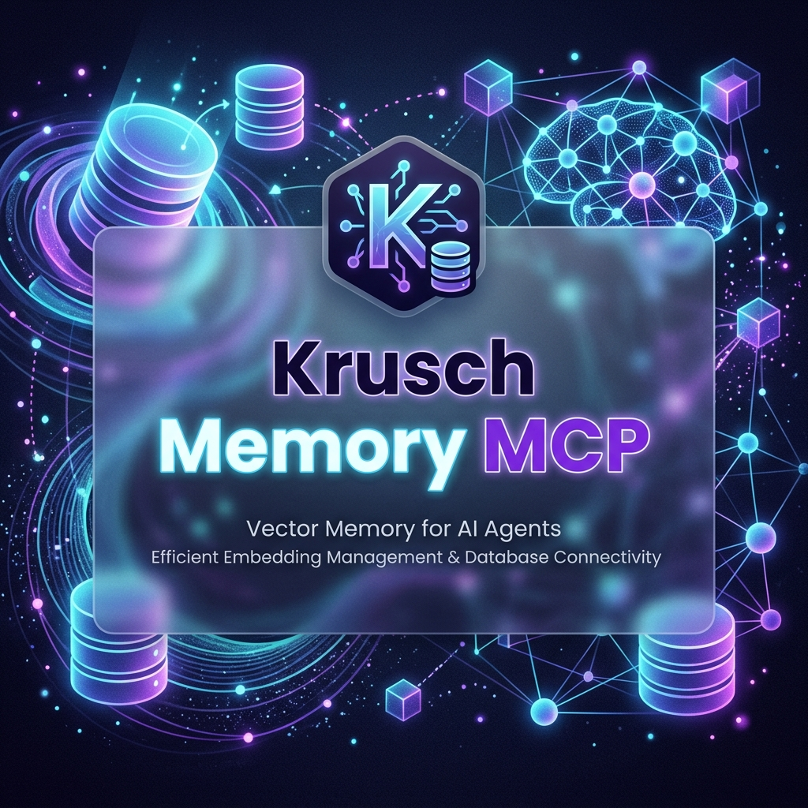

# Krusch Memory MCP

<p align="center">
  
</p>

A persistent, local-first semantic memory MCP server for IDEs, featuring dual SQLite/PostgreSQL support. Instead of your agent forgetting previous bugs, lessons, or project outcomes when you close the editor, it retrieves them using fast vector embeddings.

[](https://badge.fury.io/js/krusch-memory-mcp)
[](https://opensource.org/licenses/MIT)


## ⚡ Quick Start

You **must** have [Ollama](https://ollama.com/) running with the `nomic-embed-text` model pulled:
```bash
ollama run nomic-embed-text
```

**1. Install the MCP globally:**
```bash
npm install -g krusch-memory-mcp
```
*(Or use the 1-command installer: `curl -sL https://raw.githubusercontent.com/kruschdev/krusch_memory_mcp/main/install.sh | bash`)*

**2. Run the interactive demo!**
Once installed, you can instantly verify that your Ollama connection and Database are working correctly:
```bash
krusch-memory-demo
```
This will spin up a temporary in-memory database, insert a mock memory, and retrieve it using vector search.

**3. Add to Claude Desktop (`claude_desktop_config.json`):**
```json
{
  "mcpServers": {
    "krusch-memory": {
      "command": "krusch-memory",
      "args": [],
      "env": {
        "DB_MODE": "sqlite",
        "OLLAMA_URL": "http://localhost:11434",
        "EMBED_MODEL": "nomic-embed-text"
      }
    }
  }
}
```

**4. Add to Headless Agents (OpenClaw / Hermes):**
If you are running autonomous AI swarms, you can plug the MCP directly into their configuration files (e.g., `~/.openclaw/mcp_client_config.json`):
```json
{
  "mcpServers": {
    "krusch-memory": {
      "command": "krusch-memory",
      "args": [],
      "env": {
        "DB_MODE": "postgres",
        "OLLAMA_URL": "http://localhost:11434"
      }
    }
  }
}
```
*(Note: For high-throughput agent swarms, we highly recommend setting `DB_MODE` to `postgres` rather than the default `sqlite`.)*

**5. Restart your Agent / Claude Desktop.** That's it!

---

## 🚀 Real-World Usage Examples

To effectively use Krusch Memory, simply speak to your IDE agent normally, instructing it to document its findings.

**Example 1: Documenting a bug fix**
> **You:** "That fixed the port conflict! Please save this to memory so we don't forget the fix."
> **Claude:** *[Calls `add_memory`]* "I've saved a memory in the 'bugs' category noting that the backend port 5441 conflicts with our legacy DB and we should use 5442 instead."

**Example 2: Recalling architectural decisions**
> **You:** "How did we decide to structure the user authentication last week?"
> **Claude:** *[Calls `search_memory`]* "Looking at the 'priorities' and 'lessons' categories, I see we decided to use a singleton JWT factory to avoid circular dependencies."

**Example 3: Utilizing Category Filtering**
> **You:** "What are my goals for today?"
> **Claude:** *[Calls `search_memory` with category='priorities']* "According to your priorities, you wanted to finish the CLI demo first."

### How Does it Handle Similar Memories?
If you add multiple slightly different memories over time, the MCP returns the **Top 3** highest cosine-similarity matches. Because Krusch includes **Exponential Temporal Decay**, if you have two very similar memories, the *newer* one will have a slightly higher score, preventing your agent from hallucinating based on outdated facts.

---

## 🤖 The Autonomous Agent Workflow (`/close` & `/continue`)

A major challenge with AI coding agents is "Goldfish Memory"—when you start a new session, the agent completely forgets what it was doing, the nuances of your codebase, and the bugs it just solved. 

By combining **Krusch Memory MCP** with a file-based state tracker (e.g., `INFLIGHT.md`), you can create a seamless, persistent workflow that dramatically improves code quality and prevents the agent from repeating past mistakes. *(Note: A starter template is included in this repository at `.agent/templates/INFLIGHT.md`)*.

### 1. The `/close` Workflow (Pause Work)
When stepping away from a task, tell your agent `/close`. The agent will autonomously:
1. **Save Local State:** Write exactly what files it was modifying, what components are currently fragile, and the immediate next steps into an `INFLIGHT.md` file.
2. **Commit to Long-Term Memory:** Call the `add_memory` tool (e.g., `category: "lessons"` or `"activity"`) to embed the high-level architecture decisions, outcomes, or hard-won bug fixes from that session into the Krusch Vector Database.

### 2. The `/continue` Workflow (Resume Work)
When you start a completely blank session the next day, simply type `/continue`. The agent will:
1. **Read Local State:** Instantly read the `INFLIGHT.md` file to re-orient itself on the active task list.
2. **Retrieve Semantic Context:** Call the `search_memory` tool to dynamically load the relevant historical context, preventing it from hallucinating decoupled architectures or breaking established project rules.

**The Result:** The agent dynamically pulls the exact context it needs, effectively giving it infinite continuity across infinite sessions.

---

## 🗄️ Database Comparison: SQLite vs PostgreSQL

Krusch Memory offers two modes out of the box, controlled via the `DB_MODE` environment variable.

| Feature | SQLite (`sqlite`) | PostgreSQL (`postgres`) |
|---------|-------------------|--------------------------|
| **Best For** | Solo developers, lightweight setups. | Enterprise, high-volume swarms logging every action. |
| **Dependencies** | None (Built-in to node module). | Requires `pgvector` (Docker Compose provided). |
| **Speed** | 1-5ms (for up to ~10k vectors). | Native HNSW C-index (instant at 100k+ vectors). |
| **Setup** | Zero config. | Requires database connection string. |

*(For instructions on migrating or configuring Postgres, see our [Advanced Topics Guide](docs/advanced-topics.md)).*

---

## 🛠️ Configuration & Troubleshooting

### Claude Config Properties
| Variable | Description | Default |
|----------|-------------|---------|
| `DB_MODE` | The database engine to use (`sqlite` or `postgres`). | `sqlite` |
| `OLLAMA_URL` | The endpoint for your local Ollama instance. | `http://localhost:11434` |
| `EMBED_MODEL`| The Ollama text-embedding model to use. | `nomic-embed-text` |
| `AUTO_TAG` | Whether to use a local LLM to extract tags from memories. | `false` |
| `TAG_MODEL` | The Ollama model to use for auto-tagging. | `llama3.2` |
| `DECAY_RATE` | Exponential decay rate applied to older memories. | `0.01` |

### Troubleshooting

- **Ollama API returned 404**
  *Cause:* You haven't pulled the embedding model.
  *Fix:* Run `ollama pull nomic-embed-text`.
- **ECONNREFUSED 127.0.0.1:11434**
  *Cause:* Ollama is not running. 
  *Fix:* Start the Ollama desktop app, or run `ollama serve`.
- **Database is locked (SQLite)**
  *Cause:* Multiple instances trying to write simultaneously.
  *Fix:* Krusch Memory is primarily designed for a single IDE instance in SQLite mode. If running multiple agents simultaneously, use Postgres.

---

## 📖 Further Reading
See the [docs/advanced-topics.md](docs/advanced-topics.md) file for:
- Migrating from SQLite to Postgres.
- Swapping Embedding Models.
- How Temporal Decay works.

## 🧪 Testing

Krusch Memory MCP uses the native Node.js test runner. You can run the test suite locally:
```bash
npm test
```
*Note: The integration tests will gracefully skip the database insertion/search tests if you do not have Ollama running locally, to prevent CI/CD failures.*

## License
MIT License. Created by [kruschdev](https://github.com/kruschdev).
